```{r setup, include=FALSE}
knitr::opts_chunk$set(echo = TRUE)
```

This file is an attempt to create a short/simple tutorial on how to setup R
and RStudio with renv and git. It tries to start from the perspective of 
someone who has never used R or R Studio before.

The main function/purpose is to send it to new lab folks, so they can get
started with minimal fuss and hand holding.

## 1) Download R and R Studio ##

At ETHZ, you are likely to have various bits of software already installed
on your machine via "ETH Self Service". The problem with this in the context of
R is that anything in ETH Self Service gets automatically updated when a new 
version is available. That can be a massive problem for reproducibility. The solution
is to first remove R and R studio from ETH self-service - just open ETH self service 
and click "uninstall" on R and R Studio. Then follow the links below and install
both in a regular manner.

We tend to use Macs, so install links are as follows:

Download R: https://cran.r-project.org/bin/macosx/

Download R Studio Desktop: https://posit.co/download/rstudio-desktop/


Just FYI, keep in mind that you can use R without using R Studio at all. But I 
think there are many benefits from using R Studio and our lab's workflow stems 
from using R Studio. 

## 2) Create an R Project (.Rproj) ##

This is a lab preference (it is not essential), but I would encourage you to 
ALWAYS work within an R project. It takes a little more time to setup but it is 
really valuable, in terms of reproducibility and package management (see next 
few sections). So when you start a new project or you want to try something
out, I would always start an R project or add a new file to an existing project
if it is thematically relevant.

Some reasons for using R projects are outlined here:

https://rfortherestofus.com/2022/10/rstudio-projects

https://www.tidyverse.org/blog/2017/12/workflow-vs-script/


To create a new project:

open R Studio, then hit: File &rarr; New Project.

```{r, echo=FALSE}
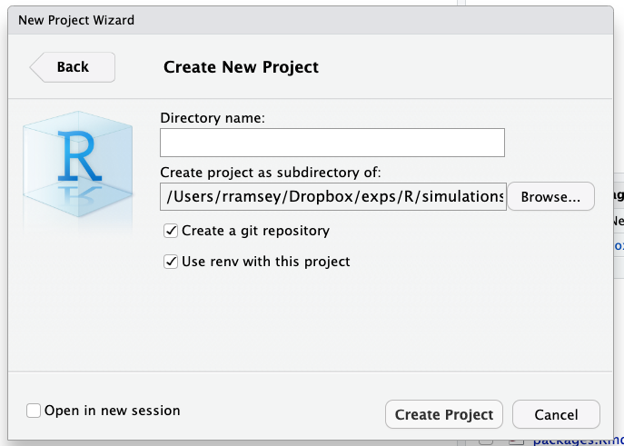
```


Use the browse button to choose a base folder, then insert a name for the 
new folder. I would also tick the box to say "Open in a new session" (bottom left).

As you can see, renv and git are automatically ticked in this workflow and that's
what you want, so just leave them as they are.


Something that looks like this should open:

```{r, echo=FALSE}
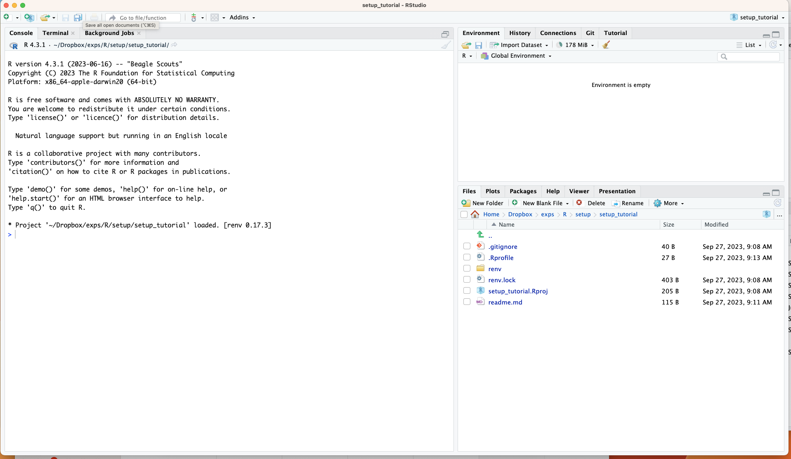
```


## 3) Modify settings for renv ##

renv is really useful for package management when using R. And the ability to use
it is one of the many benefits of working within R projects.

See here: https://rstudio.github.io/renv/articles/renv.html

The above article tells you all you need to know. I'll just show you here how to
adapt the basic settings so that it works in the way we want to.

To modify settings, click on .Rprofile in the bottom right panel. And this 
should open.

```{r, echo=FALSE}
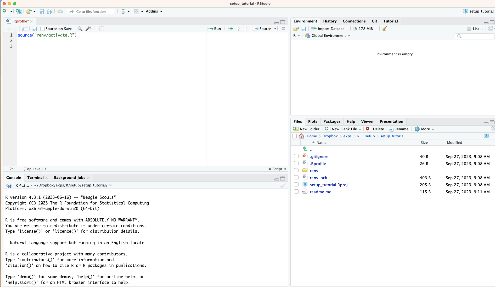
```


then add the following lines of text and save the file:

options(renv.settings.vcs.ignore.local = "FALSE")
renv::settings$snapshot.type("all")

```{r, echo=FALSE}
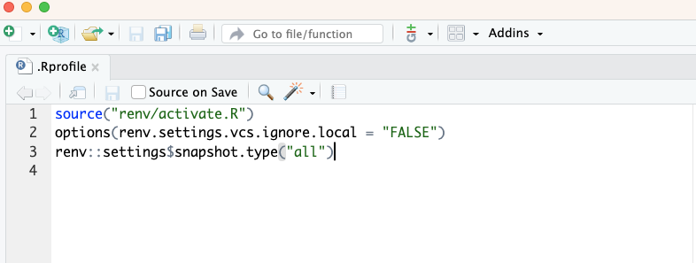
```


## 3) Modify the .gitigore file ##

git is a version control tool. It keeps track of every change that you make in
your project. Git is different to GitHub although they are often working together.
e.g., you can and should use git, even if you never feel the need to host your
project on github so others can grab the code or access the project. Now it may 
seem like the perfect thing to do, but I just wanted to make the point that git
can be extremely useful to you and only you because it is made for version control,
so you don't have to bother with the infinte regress of file naming conventions.

loads of links are online outlining the benefits: 
e.g., https://www.nobledesktop.com/blog/what-is-git-and-why-should-you-use-it

And a tremendous tutorial is available that is specifically designed for those
using R and R Studio. I cannot emphasise how good this tutorial is because git
can be a weird place to walk into initially. But this tutorial does all the hard 
work for you.

Vuorre and Curley, 2018: 
https://journals.sagepub.com/doi/full/10.1177/2515245918754826


ok, so with a brief intro to git over, you want to modify the gitignore file. 
This file - as it sounds from the name - is just a list of things for git to 
ignore (i.e., things that it will NOT keep track of). There may be a bunch of
reasons for this e.g., system files, sensitive material, or large files. The
large file example is relevant in my workflow. If we have data, figures or model
objects that are larger than 100mb, then GitHub does not like it. So if you never
plan on using github, this is not a problem. However, I often want to link projects
to a GitHub repository for sharing and open access reasons. Therefore, I typically
start by ignoring all folders where large files might be generated. This means 
that git will not track these folders (but of course they will still exist).

This also means that your GitHub repo (repository) will NOT have any of these 
files/folders. Instead, it will have all the code and everything not listed in 
the .gitignore file. So, if other folks want to run your code, they can take it
from GitHub. But if they want to download the data or figures, they would need to
hope over to the OSF page and download them from there. I realise that this might
seem a bit fiddly (that's because it is), but GitHub was not built for big files,
it was built for version control in code and other things. So, that's what we have.

To edit the .gitignore file, click on it (bottom right panel of R Studio)

```{r, echo=FALSE}
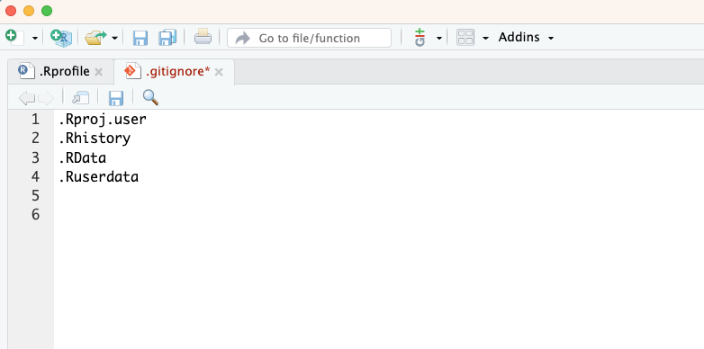
```


Then add in any additional files or folders that you want to ignore, in my case
any folders that may have large files in them ultimately.

```{r, echo=FALSE}
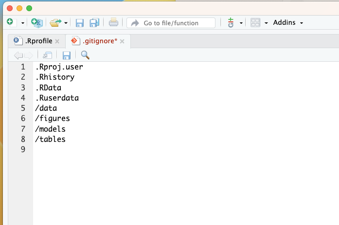
```


Of course, you can do all of this at the command line. I'm just showing you the 
RStudio way.


## 4) Start working with an R Markdown file ##

I tend to use R Markdown files (.Rmd) for everything, so I don't use R  
files (.R). This is just a preference. .Rmd can do a bunch of other things, which
I think are rather useful, but others may disagree. 

See here: https://rmarkdown.rstudio.com/

And a cheat sheet here: https://rmarkdown.rstudio.com/lesson-15.HTML

And here: https://raw.githubusercontent.com/rstudio/cheatsheets/main/rmarkdown-2.0.pdf


To create a new R Markdown file, click 'file' &rarr; 'New File' &rarr; 'R Markdown'
and give it a name e.g., wrangle or plot or model. Something that is functionally
useful.

And this should appear


```{r, echo=FALSE}
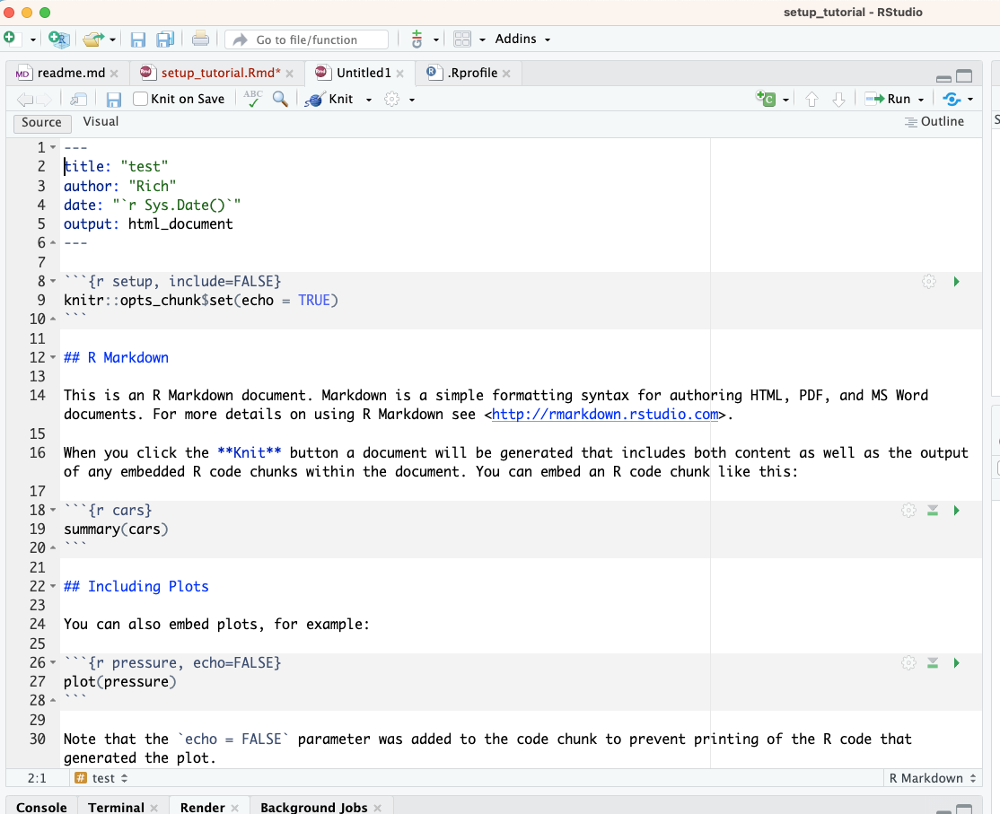
```


delete the automatically populated text, so you are left with this


```{r, echo=FALSE}
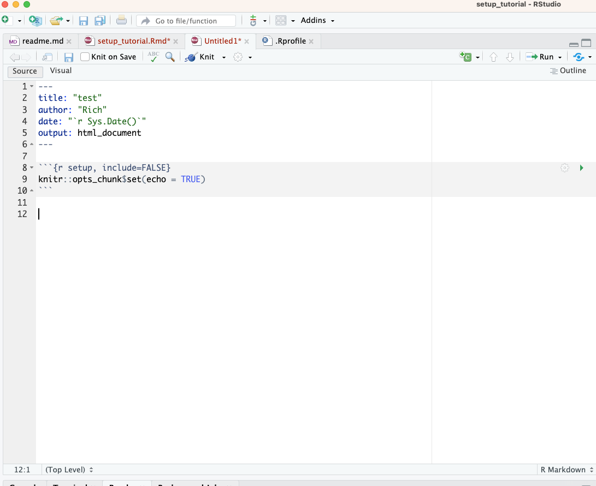
```


save the file  


```{r, echo=FALSE}
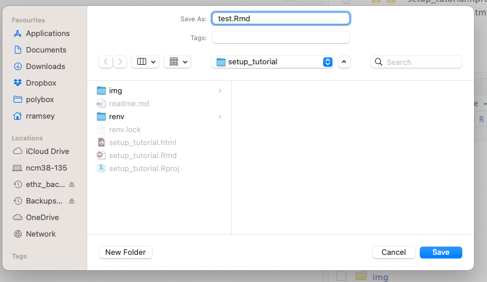
```


change the output from inline to console. This is just a personal preference,
but I find it really annoying to have all the code chunks build within the 
file (i.e., inline). So I change it to build or produce output in the console.

Hit the wheel button next to 'Knit' and change to "Chunk output in console".


```{r, echo=FALSE}
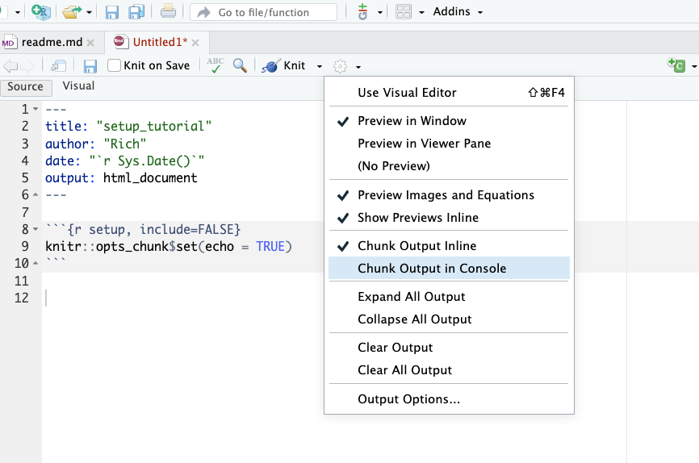
```


## 5) example workflow using renv and git ##

A quick summary of what we have so far:
- You have an R project setup.
- renv and git are activated and settings have been adjusted.
- You've started an R markdown file.


Now that you have an R Markdown file on the go, let's see a basic workflow for
package management via renv and version control via git. But see renv and git
links above for extensive documentation.

First, you would install packages in the usual way e.g.,

```{r}
# install.packages("tidyverse")
```

then you would "snapshot" those packages with renv - this creates a renv.lock file
that records the package versions and detaisl that are used in this R project.

```{r}
# renv::snapshot()
```

You only need to install packages and snapshot once, unless you want to re-install
or update packages. This is why these lines of code above have been commented out.


then load packages as normal. e.g.,

```{r}
library(tidyverse)
```


Then whenever you feel is a good time to use git to "commit" the work to history
go to the git tab (top right panel) and follow the instructions from the git
tutorial. e.g., this panel will show what has changed since the last commit, then
you choose the file and provide a description of the change and then hit commit.

The first time you make a commit for a project, evernything is new, so everything 
will need a commit.

start the first commit

```{r, echo=FALSE}
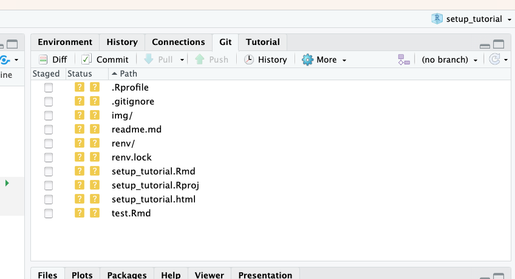
```

staging

```{r, echo=FALSE}
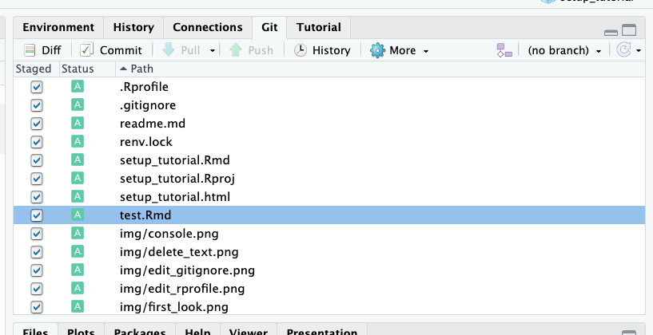
```

add a commit message

```{r, echo=FALSE}
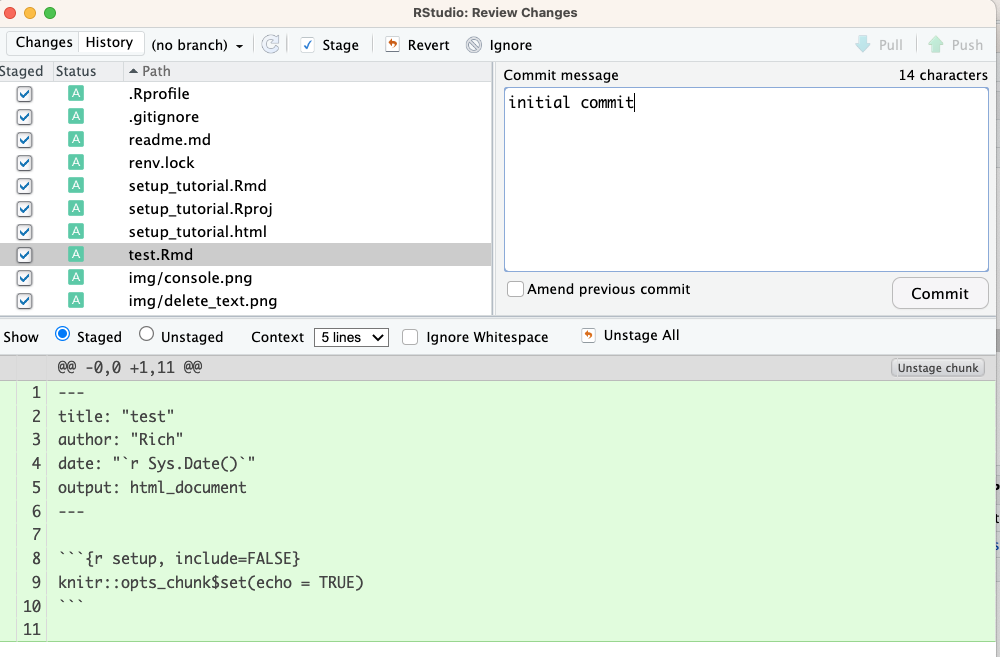
```

the commit is done when you see this

```{r, echo=FALSE}
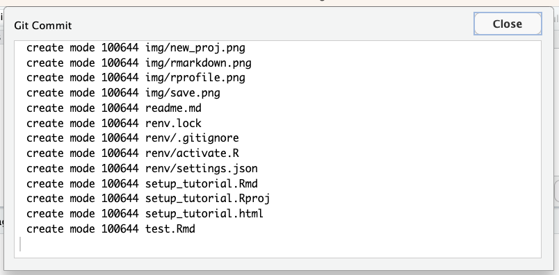
```


From now on you would just add commits whenever you think is sensible. e.g.,
end of everyday or big chunk of stuff. But fairly frequently.


## 6) a special mention for using brms / stan / cmdstan ##

The package installation routine for the vast majority of R packages is as 
was detailed above in section 5.

However, if you want to use brms to build Bayesian regression models, which is
a front-end for STAN, then things are a little more complicated and seemingly
change rather frequently.

Speak to Rich for example workflows. But the key things to keep in mind are that
to work with brms / stan, several additional steps are required.

1) The toolchain needs configuring. Yep, I wish I knew what that was. It *might*
be the case that for modern macs with a recent OS, things are all good to start 
with. This has been my expeirence with macs supplied by ETHZ.

2) As of the summer of 2023, I use cmdstand to build Bayesian models. But I do
this through brms with the "backend" option set to cmdstan.

What this means is that brms and cmdstan need to be installed and the settigs 
adjusted approproiately. 

Anyway, speak to Rich, as he has a bunch of other setup files that deal with 
the toolchain and cmdstand specifically.

The good news is that once you have things setup, you can just load cmdstand and 
brms like other packages and away you go. That is, you only need to setup the
toolchain and cmdstan once on your machine. After that you just load it in an 
.Rproj like any other package.